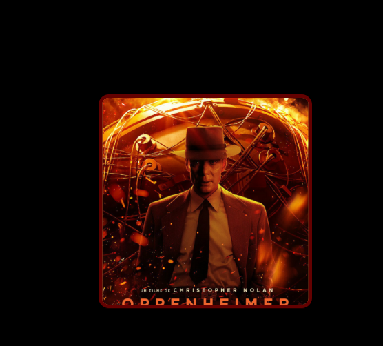
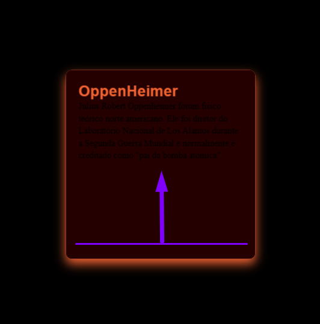

# Efeitos de Estilizacao:

>Tecnologias Utilizadas:
<table>
  <tr>
    <td>HTML</td>
    <td>CSS</td>    
  </tr>
</table>

## Funcinamento:

O usuario ao passar o mouse sobre a imagem, ira subir um <strong>CARD</strong> informativo.

Após passar o mouse

 Atenção o codigo esta comentando para melhor comprenção.⚠️ 
 
  