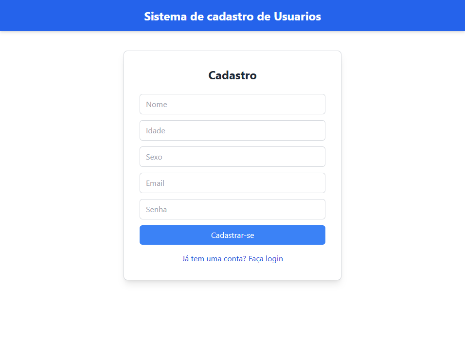
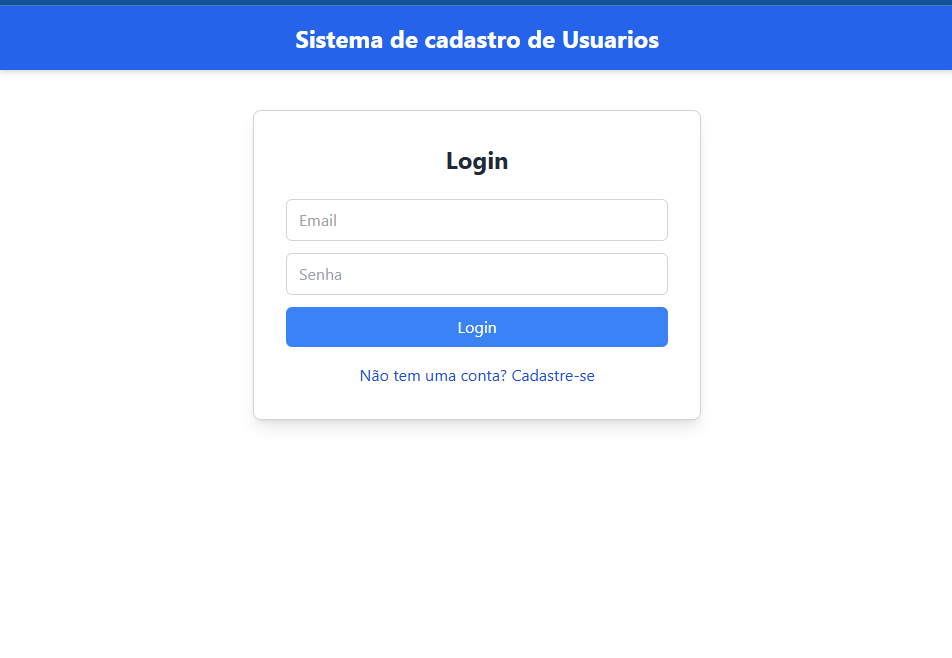
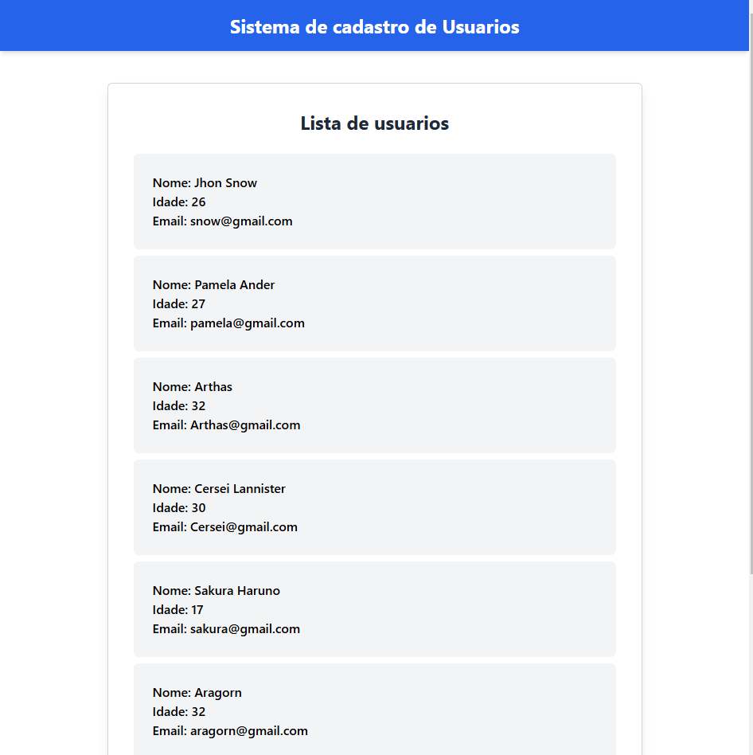

# Sobre este projeto:
Um cadastro de usuario simples, usando o Reacket, NodeJS, Prisma e MongoDb.

## Pagina de Cadastro:
Um cadastro de usuario simples, usando o Reacket, NodeJS, Prisma e MongoDb.

## Pagina de Login:
Todos os usuarios cadastrados estão no base de dados do MongoDb, no processo foi usado biblioteca JWT e Prisma.

## Pagina de Listagem de Usuários:
Todos os usuarios listados estão sendo buscasdos direto da base do MongoDb.

Conteudo disponivel no link: https://www.youtube.com/watch?v=3u6RRDhasCY&t=150s