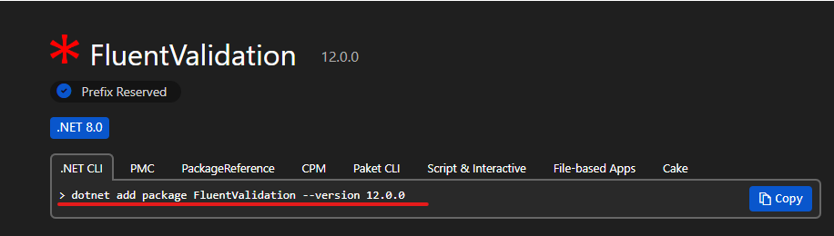
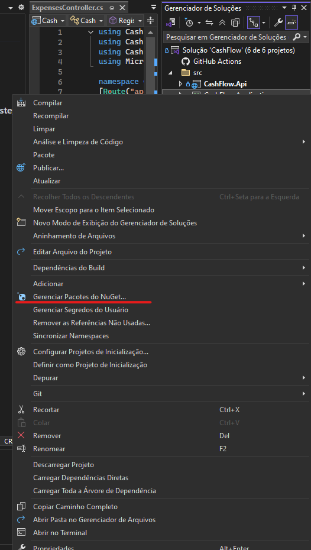
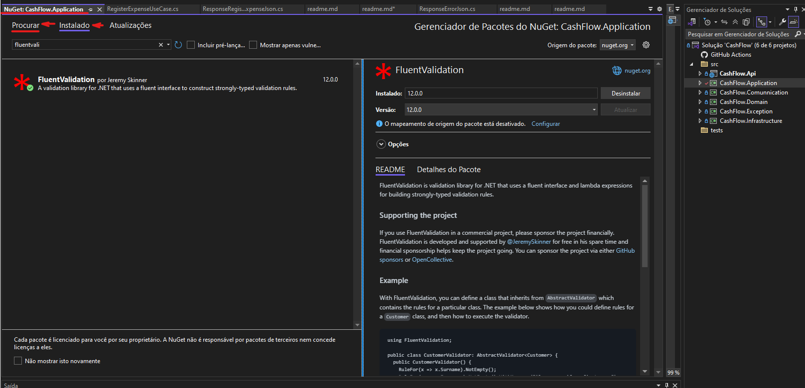

## Informacoes.

A biblioteca de Aplicacao, ser� responsavel conter as regras de negocio, recebendo os dados do projeto API.

Processando a informacao e devolvendo a resposta ou erro conforme a necessidade.
No caso de um cadastro de Email, a aplicacao verificara **se ja existe, se senha esta correto, se eh um email valido e etc**.

### Usando o NuGet.
O nuGet eh um gerenciador de bibliotecas para o .NET, disponivel para toda a plataforma 
.NET. 

Pode ser adicionando acessado o site do NuGet e buscando pela biblioteca e depois 
adicionado o projeto por CLI.

Em seguida acessar pelo CMD o diretorio e adiciona-lo ao projeto.

Tambem pode ser adicionado direto pelo Visual.
Bastando clicar sobre o Projeto e adiciona-lo.

Pode ser adicionado uma pacote de dentro de uma classe, projeto ou solucao.
se for na solucao podera ser visto todos as bibliotecas existentes no projeto.

