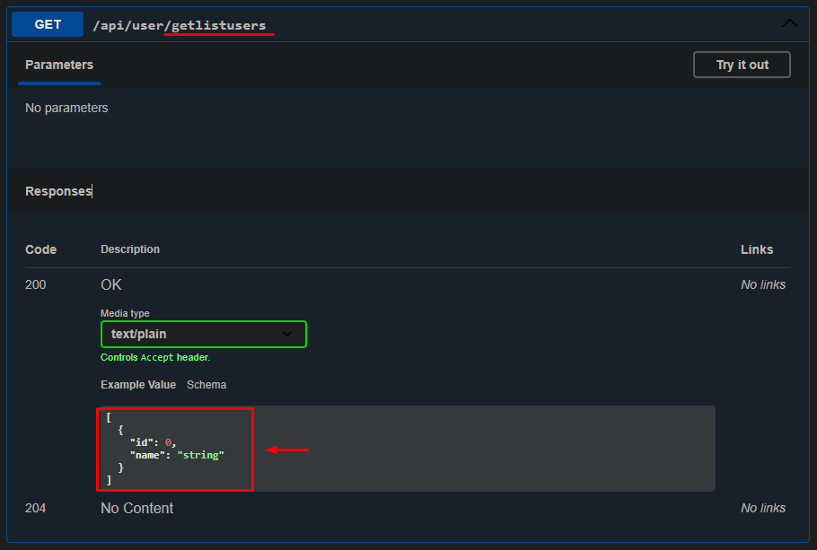
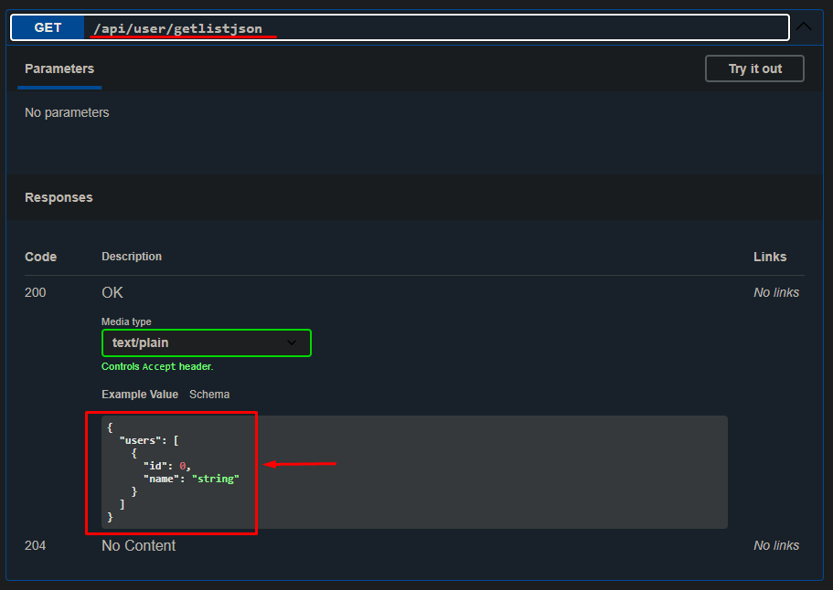

# Informacoes

### Comunnication.
Geralmente o codigo contido dentro dessa classe ou proeto, sera apenas para especificar tipo do objeto.
Que sera usado para enviar e devolver informações, que posteriormente podem ser manipuladas ou apenas apresentadas aos usuario final.

#### Request.
Na classe *`REQUEST`* constara as informacoes de requisicao que o objeto precisa para ser criado.

#### Response.
Na classe *`RESPONSE`* constara as informacoes de resposta que o objeto devolvera apos ser criado.
Isso porque alguns Endpoints precisa de respostas como lista, JSON entre outras.

#### Retornando lista: 
Em alguns casos será necesssario retornar uma lista(array) geralmente para outras regras de negocio do proprio backend.
 
> [HttpGet("getListUsers")] 
>    **[ProducesResponseType(typeof(``List<ResponseRegisterUserJson>``),StatusCodes.Status200OK)]**
>   [ProducesResponseType(StatusCodes.Status204NoContent)]
>>   public IActionResult GetListUsers(){
>>   //Sera retornado uma lista(array) de usuarios
>>       return Ok();
>>   }
>   

#### Retornando uma lista de Objetos.
Em alguns casos sera necessario retonar uma ``lista de objetos JSON``, isso varia conforme a necessidade do FrontEnd.
O codigo foi alterado para que seja retornado uma lista de Objeto.

>
> [HttpGet("returnPets")] 
>    **[ProducesResponseType(typeof(ResponseRegisterListJson),StatusCodes.Status200OK)]**
>    [ProducesResponseType(StatusCodes.Status204NoContent)]
>>    public IActionResult GetAll([FromRoute] int id)
>>    {
>>       //Sera retornado uma lista de JSON.
>>        return Ok();
>>    }
>

