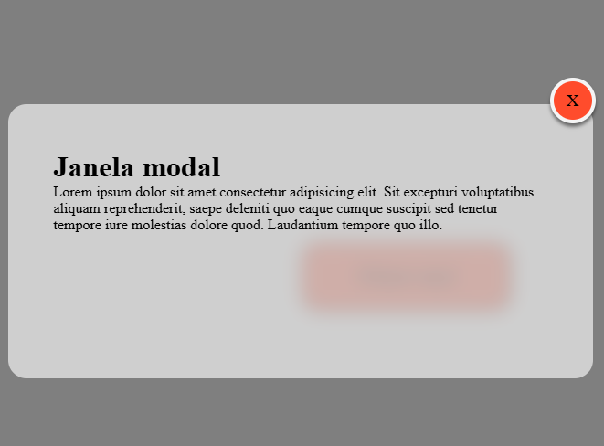
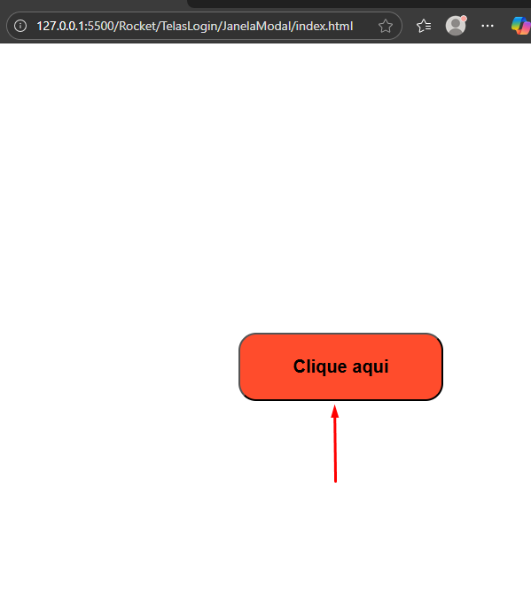
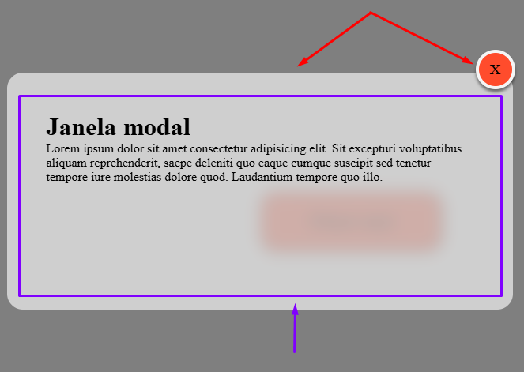

# Informacões

Este pequeno projeto se trata apenas de uma tela de Modal simples.
Em que será utilizado:
- HTML
- CSS
- JavaScript

Por padrao as janelas modais sao sempre inseridas no final da estrutura do HTML.

O resultado final desta tela será:

Seu funcionamento, basicamente consiste em um campo clicavel, como botões ou links.
 

Ao ser clicado ira abrir o modal como na imagem inicial, esta janela sera o modal, ela pode conter alguma informação ou até mesmo um formulario.

Para fechar a janela do modal bastará clicar fora do modal ou no botao de fechar.

No caso clicando na area marcada de roxo o modal permanecerá aberto, já clicando fora ou no `X` ou nas areas indicadas pela seta vermelha irá fechar o modal.

# A nivel de codigo JavaScript
No codigo JS primeiramente será preciso selecionar o elemento que envovel todo o modal, que no caso é a constante `MODAL`.

> const modal = document.getElementById('janela_modal')

Em seguida deverá ativar o estilo CSS para que o usuario possa ver o modal.
>    modal.classList.add('abrir_modal')

E por ultimo devera ser feita a verificação se foi clicado para fechar o modal. E remove a classe de estilo do CSS.
> modal.addEventListener('click', (e)=>{ 
>
> if(e.target.id == 'fechar' || e.target.id == 'janela_modal'){
>           modal.classList.remove('abrir_modal')
>        }
>
>}

O codigo completo ficará desta forma:

    function ativaModal(){
        const modal = document.getElementById('janela_modal')
        modal.classList.add('abrir_modal')
    
        modal.addEventListener('click', (e)=>{ 
                        
            if(e.target.id == 'fechar' || e.target.id == 'janela_modal'){
                modal.classList.remove('abrir_modal')
            }
        })
    }