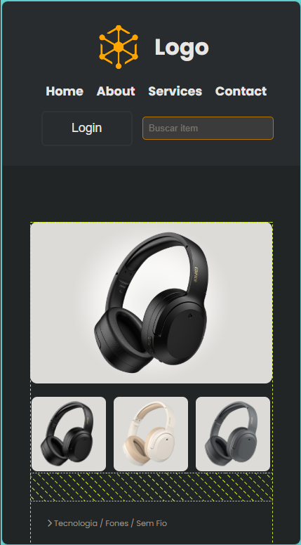
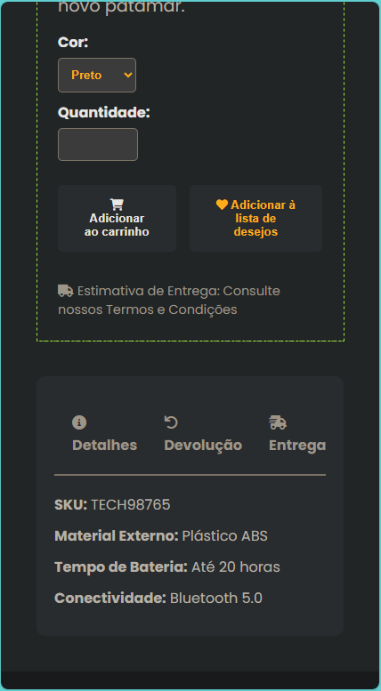

# Informacões

Este pequeno projeto se trata apenas de uma tela de LOGIN simples.
No codigo fonte poderá ter informações comentadas.
No projeto será utilizado:
- HTML
- CSS. 

O resultado final desta tela será:

Ao utilizar em um celular.

