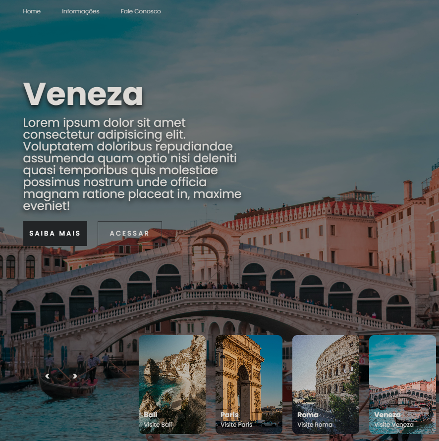
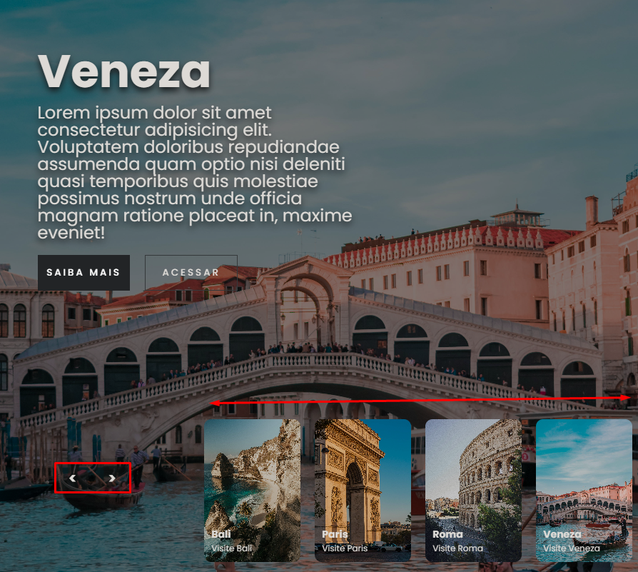
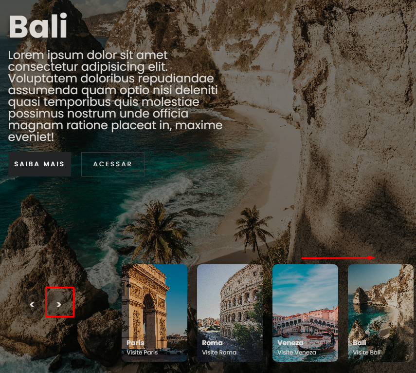

# Informacões

Este pequeno projeto se trata apenas de uma tela de Slides simples.
Em que será utilizado:
- HTML
- CSS
- JavaScript

O resultado final desta tela será:

# Efeitos
Ao clicar na seta direcional, os cards serao movidas conforme o sentido ao qual foi clicado(frente/trás).

Ao clicar na seta direcional ***> para frente***, o os cards irão se mover no sentido da seta, neste caso sairemos do card de *Veneza* e para o de *Bali*.
E tambem será espandida sua imagem, e um efeito de animação em seu conteudo de testo.

O mesmo ocorrera caso seja clicado na seta direcional ***> para tras***.
No codigo JavaScript e CSS há anotações para melhor comprrensão.
